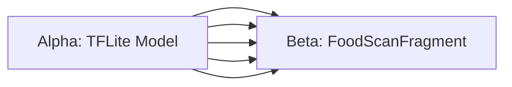

# EATOMO Android — Agile/Scrum cho Team 5 Người

> Dự án: Android Native App (Java + Kotlin hybrid)  
> Team size: 5 người | Tổng timeline: 14 tuần  
> Methodology: Agile Scrum

---

## 🏗️ PHÂN TÍCH ĐẦU VÀO

### Cấu trúc công việc (từ ANDROID_APP_PLAN.md)

| Phase | Nội dung | Tuần |
|-------|----------|------|
| Phase 1 | Foundation: setup, DI, networking, auth, theme | T1–T3 |
| Phase 2 | Core Features: home, bowls, cart, checkout, orders, chat | T4–T7 |
| Phase 3 | Advanced: push notif, biometric, deep links, offline | T8–T10 |
| Phase 4 | AI (Visual Bowl Recognition) + Polish + Testing | T11–T14 |

### Workload phân tích

```
Tổng stories ước tính:
├── Foundation:     ~30 story points
├── Core Features:  ~80 story points  
├── Advanced:       ~40 story points
└── AI + Polish:    ~50 story points
                    ──────────────
TOTAL:             ~200 story points / 14 tuần
```

---

## 👥 BA PHƯƠNG ÁN AGILE/SCRUM

---

## PHƯƠNG ÁN A — "Classic Scrum" (Khuyến nghị cho đồ án)

### Đặc điểm
- **Sprint**: 2 tuần/sprint → 7 sprints tổng
- **Roles** rõ ràng, chuẩn Scrum
- **Ceremonies** đầy đủ nhưng gọn nhẹ
- **Phù hợp**: Team chưa có nhiều kinh nghiệm Agile, cần cấu trúc rõ ràng

### Phân vai (5 người)

| Vai | Người | Trách nhiệm chính |
|-----|-------|-------------------|
| **Product Owner (PO)** | Thành viên A | Quản lý Product Backlog, viết User Stories, accept/reject tasks, ưu tiên features |
| **Scrum Master (SM)** | Thành viên B | Facilite ceremonies, remove blockers, track velocity, báo cáo burndown |
| **Android Lead Dev** | Thành viên C | Architecture, code review, merge PRs, technical decisions |
| **Android Dev** | Thành viên D | Feature development, unit testing |
| **Android Dev / QA** | Thành viên E | Feature development + manual testing, bug reports |

> **Lưu ý**: PO và SM vẫn code (part-time role), không full-time management.

### Sprint Structure (2 tuần/sprint)

```
Sprint Timeline (14 ngày):
┌─────────────────────────────────────────────────────┐
│ Ngày 1:   Sprint Planning (2-3 giờ)                 │
│ Ngày 1-13: Development + Daily Standup (15 phút/ngày)│
│ Ngày 13:  Sprint Review + Demo (1-2 giờ)            │
│ Ngày 14:  Sprint Retrospective (1 giờ)              │
└─────────────────────────────────────────────────────┘
```

### 7 Sprints Roadmap

```
SPRINT 1  (T1–T2): Foundation Setup
├── Project setup + Gradle + dependencies
├── Hilt DI modules (Network, DB, Repository)
├── Retrofit API interfaces (tất cả endpoints)
├── Room Database + DAOs
├── AuthInterceptor + TokenManager
├── Navigation Component + nav_graph
└── Material 3 theme + brand colors
───────────────────────────────────────
Goal: App build được, gọi API thành công

SPRINT 2  (T3–T4): Auth + Home
├── Splash screen
├── Login / Register Fragment + ViewModel
├── JWT flow (login → store token → auto-attach)
├── Home screen: hero banner + featured bowls
└── Profile screen (cơ bản)
───────────────────────────────────────
Goal: User đăng nhập được, thấy trang chủ

SPRINT 3  (T5–T6): Bowls + Cart
├── Bowl list: grid view + category filter chips
├── Bowl detail: nutrition card + add to cart
├── Build Your Own: step wizard (4 steps)
├── Cart: add/remove/update + persistence Room
└── Voucher validation UI
───────────────────────────────────────
Goal: User browse & add bowl vào cart

SPRINT 4  (T7–T8): Checkout + Orders
├── Checkout: địa chỉ + payment method + place order
├── Order confirmation screen
├── Order history list + timeline status
├── FAQs expandable list
└── About Us + Stores screen
───────────────────────────────────────
Goal: User đặt hàng end-to-end thành công

SPRINT 5  (T9–T10): Advanced Features
├── Chatbot integration (POST /api/chat)
├── FCM push notification setup
├── Biometric login (BiometricPrompt)
├── Deep links (bowls, orders)
└── Offline mode: cache-then-network
───────────────────────────────────────
Goal: App hoàn chỉnh, mobile-native features

SPRINT 6  (T11–T12): AI Bowl Recognition
├── CameraX setup + gallery picker
├── ML Kit food gate (Stage 1)
├── TFLite model integration (MobileNetV2)
├── Nutrition lookup database
├── Comparison engine + recommendation UI
└── Google Colab training pipeline setup
───────────────────────────────────────
Goal: Feature AI hoạt động với gallery images

SPRINT 7  (T13–T14): Polish + Testing + Release
├── Unit tests: ViewModels + UseCases
├── UI tests: Espresso cho critical flows
├── Lottie animations + skeleton loading
├── Accessibility (content descriptions)
├── Performance profiling + memory leaks
├── Bug fixing từ Sprint Review 6
└── Demo preparation + documentation
───────────────────────────────────────
Goal: App demo-ready, ổn định
```

### Ceremonies Gọn Nhẹ

| Ceremony | Tần suất | Thời gian | Format |
|----------|----------|-----------|--------|
| **Daily Standup** | Mỗi ngày | 15 phút | "Hôm qua làm gì? Hôm nay làm gì? Có blocker không?" |
| **Sprint Planning** | Đầu mỗi sprint | 2-3 giờ | Chọn stories từ backlog, estimate points, assign |
| **Sprint Review** | Cuối sprint | 1-2 giờ | Demo working app cho "stakeholders" (giảng viên) |
| **Retrospective** | Cuối sprint | 1 giờ | Start/Stop/Continue, action items |
| **Backlog Refinement** | Giữa sprint | 1 giờ | Clarify, estimate stories cho sprint sau |

### Definition of Done (DoD)

```
Một story được coi là DONE khi:
✅ Code được review bởi ít nhất 1 người khác (PR)
✅ Unit test viết cho ViewModels/UseCases liên quan
✅ Manual test trên emulator không có crash
✅ Không có Lint warnings mới
✅ Merge vào branch develop thành công
✅ Demo được trong Sprint Review
```

### Tooling

| Tool | Mục đích |
|------|----------|
| **GitHub Projects** (Kanban board) | Backlog → In Progress → Review → Done |
| **GitHub Issues** | User Stories + Bug Reports |
| **GitHub Milestones** | Mỗi Sprint là 1 Milestone |
| **Discord / Zalo** | Daily standup async, blockers |
| **Figma** | UI mockup, design review |
| **Google Sheets** | Burndown chart, velocity tracking |

### Story Points Scale (Fibonacci)

| Points | Effort | Ví dụ |
|--------|--------|-------|
| 1 | 2-4 giờ | Fix UI bug, thêm string resource |
| 2 | 4-8 giờ | Simple Fragment + ViewModel |
| 3 | 1-2 ngày | Feature screen với API call |
| 5 | 2-3 ngày | Complex feature (cart, checkout) |
| 8 | 3-5 ngày | AI integration, architecture setup |
| 13 | >5 ngày | Epic, cần break down |

### Velocity Target

```
Team velocity: ~30 points/sprint (2 tuần × 5 người)
Mỗi người: ~6 points/sprint (với daily overhead)
Tổng: 7 sprints × 30 points = 210 points ≈ khớp với backlog
```

---

## PHƯƠNG ÁN B — "Kanban + Sprint Hybrid" (Linh hoạt nhất)

### Đặc điểm
- **Không có sprint cố định** — work flows continuously
- **WIP limits** (Work In Progress) kiểm soát tải
- **Review hàng tuần** thay vì end-of-sprint
- **Phù hợp**: Team có kinh nghiệm, timeline linh hoạt, features hay thay đổi

### Phân vai (5 người — horizontal)

| Người | Primary Focus | Secondary |
|-------|---------------|-----------|
| A | Architecture + Data layer | Code review |
| B | UI/UX + Presentation layer | Animation |
| C | API Integration + Networking | Testing |
| D | Features + Business logic | Documentation |
| E | QA + Testing + AI features | Bug fixing |

> **Không có Scrum Master** — team tự tổ chức. Không có PO — team cùng decide priority.

### Kanban Board (GitHub Projects)

```
📋 BACKLOG → 🔍 REFINED → 🚀 IN PROGRESS → 👁️ IN REVIEW → ✅ DONE
                            [WIP: max 2/người]  [WIP: max 3 total]
```

**WIP Limits**:
- In Progress: tối đa 2 tasks/người (tránh context switching)
- In Review: tối đa 3 PRs chờ review (tránh bottleneck)

### Weekly Cadence

```
Thứ Hai:   Weekly Planning (1 giờ) — chọn cards từ Refined vào In Progress
Thứ Tư:    Sync meeting (30 phút) — blockers, mid-week check
Thứ Sáu:   Weekly Review + Demo (1 giờ) — show working features
            Backlog Refinement (30 phút) — prep next week's cards
Daily:      Async standup qua Discord (text format, bất kỳ giờ nào)
```

### Feature Swim Lanes

```
LANE 1: 🔴 Critical Path  (Foundation, Auth, Core flows)
LANE 2: 🟡 Features       (Bowls, Cart, Orders, Chat)
LANE 3: 🔵 Enhancement    (Animations, Polish, Performance)
LANE 4: 🟣 AI/Research    (Visual Bowl Recognition, TFLite)
LANE 5: 🟢 Testing/Docs   (Unit tests, Integration tests, README)
```

**Ưu điểm của swim lanes**: Team có thể work parallel trên nhiều lanes, AI research không block main features.

### Throughput Metric thay vì Velocity

```
Thay vì tracking "story points burned per sprint", track:
- Lead time: từ khi task vào Backlog → Done (target: < 5 ngày)
- Cycle time: từ khi In Progress → Done (target: < 2 ngày)
- Throughput: số tasks completed per week (target: 8-10 tasks/tuần)
```

---

## PHƯƠNG ÁN C — "Feature Teams Scrum" (Phân công theo feature domain)

### Đặc điểm
- **Sprint**: 1 tuần/sprint → 14 sprints
- Team chia thành **2 sub-teams** focus theo domain
- **Daily sync** giữa sub-teams
- **Phù hợp**: Team muốn ownership rõ ràng, ít phụ thuộc nhau, tiến độ nhanh

### Phân vai + Sub-teams (5 người)

```
┌────────────────────────────────────────────────────┐
│              SCRUM MASTER (1 người)                │
│         Thành viên A — rotate mỗi 4 sprints        │
└────────────────────────────────────────────────────┘
         ↙                              ↘
┌──────────────────┐           ┌──────────────────────┐
│  TEAM ALPHA (2)  │           │   TEAM BETA (2)       │
│  Thành viên B+C  │           │   Thành viên D+E      │
│                  │           │                        │
│  Focus:          │           │  Focus:                │
│  • Architecture  │           │  • UI/UX Screens       │
│  • Data layer    │           │  • User interactions   │
│  • API/Backend   │           │  • Testing             │
│  • AI/ML         │           │  • Animations          │
└──────────────────┘           └──────────────────────┘
```

### 1-Week Sprint Structure

```
Thứ Hai:    Sprint Planning (1 giờ) — cả 5 người
Thứ 2–5:   Development (mỗi sub-team tự tổ chức)
            Daily standup: 10 phút/sub-team riêng
            Cross-team sync: thứ Tư 15 phút
Thứ Sáu:   Sprint Review + Retro (1.5 giờ) — cả 5 người
```

### 14-Sprint Roadmap (1 tuần/sprint)

```
S1:  Project setup + Gradle + DI skeleton
S2:  Retrofit APIs + Room + Auth flow
S3:  Navigation + Theme + Base classes
S4:  Home screen + Bowl list
S5:  Bowl detail + Build Your Own
S6:  Cart + Voucher
S7:  Checkout + Place Order           ← Mid-project demo
S8:  Order history + Status tracking
S9:  Chat integration + Stores + FAQs
S10: Push notifications + Biometric
S11: Offline mode + Deep links
S12: CameraX + ML Kit food gate (AI Sprint 1)
S13: TFLite model + Comparison engine (AI Sprint 2)
S14: Testing + Polish + Demo prep
```

### Cross-team Dependencies



**Rule**: Alpha team phải hoàn thành Repository interface trước khi Beta team bắt đầu Fragment tương ứng (2-3 ngày gap).

### Sprint 7 — Mid-Project Demo Checkpoint

```
Sprint 7 là milestone đặc biệt:
✅ Login → Browse Bowls → Add to Cart → Place Order
✅ Fully connected to production backend (Render)
✅ Material 3 UI polished
✅ Demo cho giảng viên / stakeholders
```

---

## SO SÁNH 3 PHƯƠNG ÁN

| Tiêu chí | A — Classic Scrum | B — Kanban Hybrid | C — Feature Teams |
|----------|:-----------------:|:-----------------:|:-----------------:|
| **Cấu trúc** | ⭐⭐⭐⭐⭐ Rất rõ ràng | ⭐⭐⭐ Linh hoạt | ⭐⭐⭐⭐ Rõ ràng |
| **Dễ áp dụng** | ⭐⭐⭐⭐ | ⭐⭐⭐ (cần kỷ luật) | ⭐⭐⭐⭐ |
| **Overhead meetings** | Trung bình | Thấp nhất | Thấp |
| **Phù hợp đồ án** | ⭐⭐⭐⭐⭐ Nhất | ⭐⭐⭐ | ⭐⭐⭐⭐ |
| **Track progress** | Burndown chart | Cumulative flow | Sprint burndown |
| **Risk management** | Tốt (sprint review) | Khó hơn | Tốt |
| **Học Agile** | Đầy đủ nhất | Partial | Partial |
| **Adapt thay đổi** | Trung bình | Tốt nhất | Trung bình |

> [!TIP]
> **Khuyến nghị**: Dùng **Phương án A** làm baseline chính thức (đủ chuẩn Scrum để report trong đồ án), kết hợp Kanban board của Phương án B cho visibility hàng ngày.

---

## 📋 PRODUCT BACKLOG — USER STORIES

### Epic 1: Authentication (Sprint 1–2)

| ID | User Story | Points | Priority |
|----|-----------|--------|----------|
| US-001 | As a user, I can register with username/email/password | 3 | Must |
| US-002 | As a user, I can login and receive JWT token | 3 | Must |
| US-003 | As a user, my login persists across app restart | 2 | Must |
| US-004 | As a user, I can logout and clear session | 1 | Must |
| US-005 | As a user, I can login with biometric (fingerprint/face) | 3 | Should |
| US-006 | As a user, I can view and edit my profile | 2 | Should |

### Epic 2: Browse Bowls (Sprint 2–3)

| ID | User Story | Points | Priority |
|----|-----------|--------|----------|
| US-010 | As a user, I can see all bowls in a grid layout | 3 | Must |
| US-011 | As a user, I can filter bowls by category | 2 | Must |
| US-012 | As a user, I can search bowls by name | 2 | Should |
| US-013 | As a user, I can see bowl detail with nutrition info | 3 | Must |
| US-014 | As a user, I can add bowl to cart from detail screen | 2 | Must |
| US-015 | As a user, I can Build My Own bowl step by step | 5 | Must |
| US-016 | As a user, I see real-time calorie total in Build Your Own | 3 | Should |

### Epic 3: Cart & Checkout (Sprint 3–4)

| ID | User Story | Points | Priority |
|----|-----------|--------|----------|
| US-020 | As a user, I can view my cart | 2 | Must |
| US-021 | As a user, I can update quantity in cart | 2 | Must |
| US-022 | As a user, I can remove items from cart | 1 | Must |
| US-023 | As a user, I can apply a voucher code | 3 | Should |
| US-024 | As a user, I can enter delivery address and phone | 2 | Must |
| US-025 | As a user, I can select payment method (COD/MoMo/Card) | 2 | Must |
| US-026 | As a user, I can place an order | 3 | Must |
| US-027 | As a user, I see order confirmation with order number | 2 | Must |

### Epic 4: Order Management (Sprint 4)

| ID | User Story | Points | Priority |
|----|-----------|--------|----------|
| US-030 | As a user, I can see my order history | 3 | Must |
| US-031 | As a user, I can see order status timeline | 3 | Must |
| US-032 | As a user, I can see order items detail | 2 | Must |
| US-033 | As a user, I receive push notification when order status changes | 5 | Should |

### Epic 5: Supplementary Screens (Sprint 4–5)

| ID | User Story | Points | Priority |
|----|-----------|--------|----------|
| US-040 | As a user, I can chat with AI assistant | 3 | Must |
| US-041 | As a user, I can see store locations | 2 | Should |
| US-042 | As a user, I can browse FAQs | 1 | Should |
| US-043 | As a user, I can see About Us page | 1 | Could |
| US-044 | As a user, I can scan QR code for voucher | 3 | Could |

### Epic 6: AI Visual Bowl Recognition (Sprint 6)

| ID | User Story | Points | Priority |
|----|-----------|--------|----------|
| US-050 | As a user, I can open camera to scan food | 3 | Must (AI) |
| US-051 | As a user, I can pick food photo from gallery | 2 | Must (AI) |
| US-052 | As a user, I see detected food items with confidence % | 5 | Must (AI) |
| US-053 | As a user, I see estimated nutrition (calo/protein/carbs/fat) | 3 | Must (AI) |
| US-054 | As a user, I see Eatomo bowl recommendation with calorie comparison | 3 | Must (AI) |
| US-055 | As a user, I can add recommended bowl to cart directly | 2 | Should (AI) |

### Epic 7: Polish & Quality (Sprint 7)

| ID | User Story | Points | Priority |
|----|-----------|--------|----------|
| US-060 | App has skeleton loading on all list screens | 3 | Should |
| US-061 | App has Lottie animation on success states | 2 | Could |
| US-062 | All screens have proper error states (no network, empty) | 3 | Must |
| US-063 | App is tested with unit tests (>60% coverage) | 5 | Should |
| US-064 | App handles offline mode gracefully | 3 | Should |

---

## 🔀 GIT WORKFLOW

### Branch Strategy

```
main (production-ready)
  └── develop (integration branch)
        ├── feature/US-001-login
        ├── feature/US-010-bowl-list
        ├── feature/US-015-build-your-own
        ├── feature/US-050-food-scanner
        └── fix/crash-on-checkout
```

### Pull Request Rules

```
PR Template:
## What this PR does
[Mô tả ngắn]

## User Story
Closes #US-XXX

## Testing done
- [ ] Tested on emulator API 26
- [ ] Tested on emulator API 34
- [ ] Unit tests pass
- [ ] No Lint errors

## Screenshots / Demo
[Screenshot hoặc screen recording]
```

**Review rules**:
- Mỗi PR cần **ít nhất 1 approval** trước khi merge
- Không tự approve PR của mình
- Lead Dev review PRs ảnh hưởng architecture

---

## 📊 TRACKING & REPORTING

### Sprint Burndown Chart (Google Sheets)

```
Story Points Remaining:

Sprint 1 (30 pts):
Day:  0    2    4    6    8   10   12   14
Plan: 30   26   22   18   14   10    5    0
Act:  30   28   25   20   16   12    6    0  ← example
```

### Weekly Status Report (cho giảng viên)

```markdown
# Sprint X Report — [Ngày]

## Completed this sprint
- [x] US-XXX: [Story name] (X pts)
- [x] US-XXX: [Story name] (X pts)

## In Progress
- [ ] US-XXX: [Story name] — 70% done

## Blockers
- ❗ [Blocker description] — Owner: [Tên] — ETA: [Date]

## Velocity
- Planned: X points | Actual: X points
- Burndown: [on track / behind / ahead]

## Next Sprint Goals
- [US-XXX], [US-XXX], [US-XXX]

## Demo
[Link video/screenshot]
```

---

## ⚠️ RỦI RO VÀ GIẢM THIỂU

| Rủi ro | Khả năng | Mức độ | Biện pháp |
|--------|----------|--------|-----------|
| Member bị bệnh/bận thi | Cao | Trung bình | Pair programming, task không quá 1 người biết |
| Render cold start 30s | Trung bình | Thấp | Keep-alive cron job (ping mỗi 5 phút) |
| AI model accuracy thấp | Cao | Trung bình | Demo với gallery curated images, disclaimer rõ |
| API backend thay đổi | Thấp | Cao | API contract test, versioning |
| Merge conflict nhiều | Trung bình | Thấp | Feature branch nhỏ, merge thường xuyên |
| Scope creep | Cao | Cao | PO strict về Must/Should/Could priority |
| Tech debt tích lũy | Trung bình | Trung bình | Code review + refactor task mỗi sprint |

---

## 🎯 DEFINITION OF READY (Backlog Refinement)

Một story sẵn sàng vào sprint khi:
```
✅ User story rõ ràng: "As a [user], I can [action], so that [benefit]"
✅ Acceptance criteria đã viết (Given/When/Then)
✅ Dependency đã xác định (cần API nào? UI mockup chưa?)
✅ Story points đã estimate (cả team agree)
✅ Đủ nhỏ để hoàn thành trong 1 sprint
```

**Ví dụ story chuẩn**:
```
US-010: Bowl List Screen

As a customer
I can browse all Eatomo bowls in a grid layout
So that I can discover and choose what to order

Acceptance Criteria:
- Given I'm on the app, When I tap "Our Bowls", Then I see a 2-column grid
- Given I'm on the grid, When I tap a category chip, Then grid filters by that category
- Given no network, When I open bowls, Then I see cached data from last session
- Given loading, I see skeleton loading placeholders (not spinner)

Dependencies: BowlRepository.getAllBowls(), BowlApi.java
Estimate: 3 points
```

---

## 📅 RECOMMENDED CALENDAR — Phương án A

| Tuần | Sprint | Focus | Key Deliverable |
|------|--------|-------|-----------------|
| T1–T2 | Sprint 1 | Foundation | App chạy được, call API thành công |
| T3–T4 | Sprint 2 | Auth + Home | Login/Register + Home screen |
| T5–T6 | Sprint 3 | Bowls + Cart | Browse → Add to Cart |
| T7–T8 | Sprint 4 | Checkout + Orders | **End-to-end order flow** ✅ |
| T9–T10 | Sprint 5 | Advanced | Chat, Push notif, Biometric |
| T11–T12 | Sprint 6 | AI Feature | Food Scanner working |
| T13–T14 | Sprint 7 | Polish + Test | **Demo-ready** 🎉 |

---

*Document version: 1.0 | Created: 2026-06-08 | Team: EATOMO Android*
