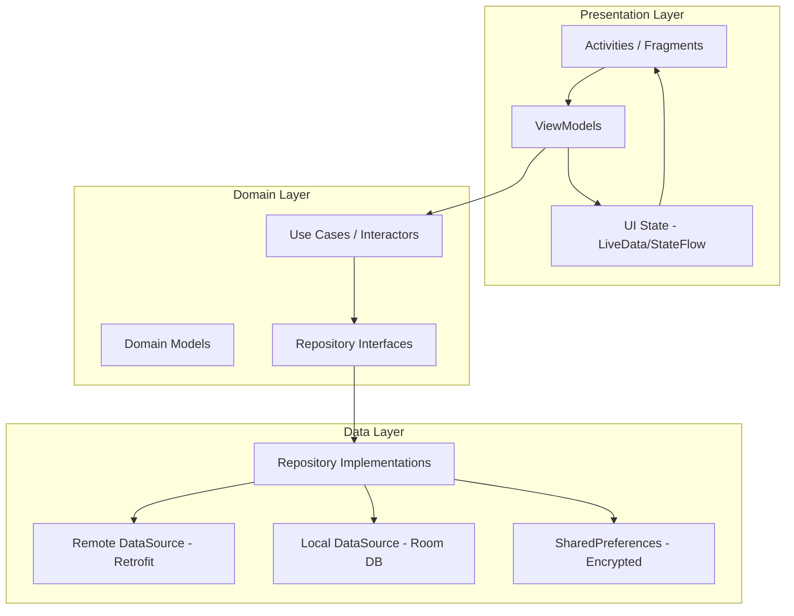
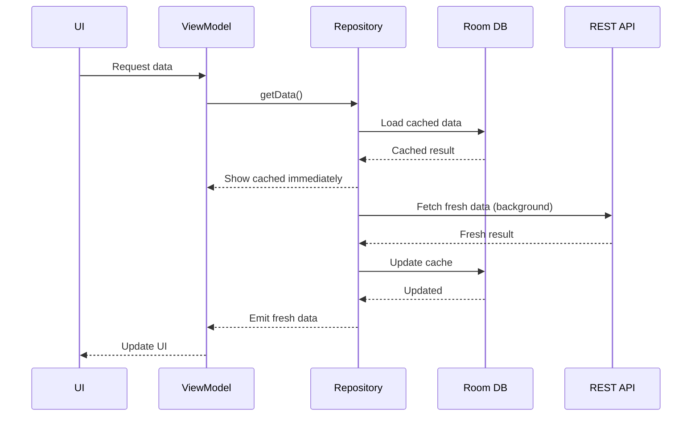
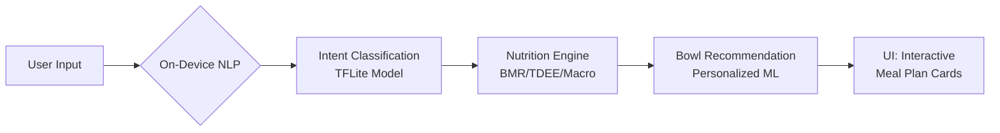
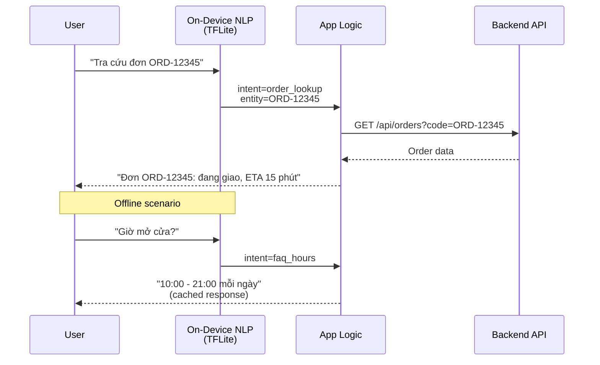
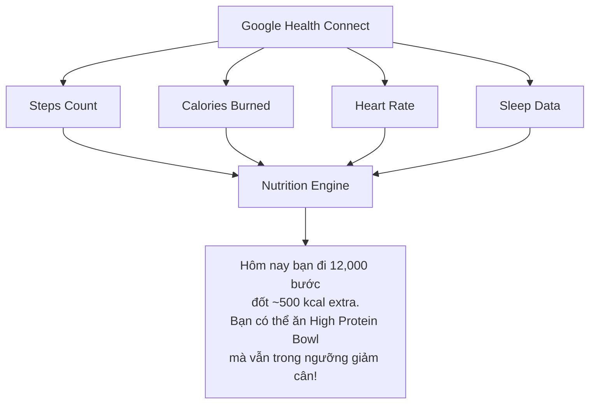
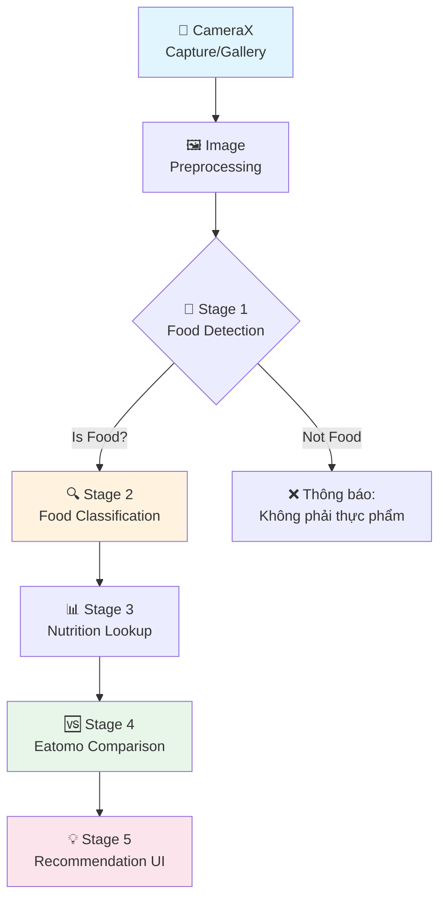
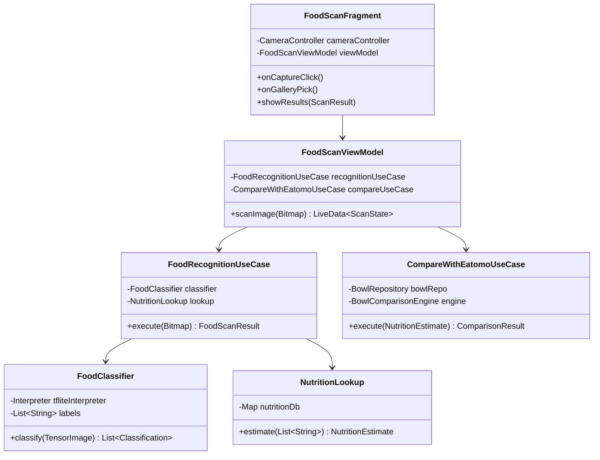

# EATOMO Android Native App — Brainstorm & Kế Hoạch Xây Dựng

## 1. PHÂN TÍCH HIỆN TRẠNG

### 1.1 Hệ thống hiện tại đã nghiên cứu

| Layer | Stack | Chi tiết |
|-------|-------|----------|
| **Frontend** | Angular 19 (standalone, signals) | 9 pages public + orders + admin panel (6 modules) |
| **Backend** | Express.js + Mongoose | REST API: auth, bowls, orders, admin, promotions, chat, admin-ai-chat |
| **Database** | MongoDB Atlas | Collections: users, bowls, orders, vouchers, admin_actions |
| **Auth** | JWT (Bearer token) | `bcryptjs` hash, 7-day expiry, role-based (user/admin) |
| **AI Chatbot** | Rule-based NLP (regex) | Intent detection, nutrition coaching, BMI/TDEE calculation, order lookup |
| **Deployment** | Vercel (FE) + Render (BE) | CORS configured cho cả localhost và production domains |

### 1.2 API Endpoints hiện có (cần kết nối)

```
Auth:      POST /api/auth/register, /api/auth/login, GET /api/auth/profile
Bowls:     GET /api/bowls, /api/bowls?category=X, /api/bowls/:id
           POST/PATCH/DELETE /api/bowls/:id (Admin)
Orders:    POST /api/orders, GET /api/orders, /api/orders/:id
           GET /api/admin/orders, PATCH /api/admin/orders/:id/status
Admin:     GET /api/admin/customers, /api/admin/dashboard/stats
           GET /api/admin/dashboard/top-products, /api/admin/dashboard/recent-orders
Promotions: GET/POST/PATCH/DELETE /api/promotions, POST /api/vouchers/validate
Chat:      POST /api/chat (customer), POST /api/admin/ai-chat (admin)
```

### 1.3 Data Models cần map sang Java

```
Bowl:     id, name, description, price, calories, protein, carbs, fat, category, image, inStock
User:     id, username, email, role, fullName, phone, address, totalOrders, totalSpent
Order:    id, userId, orderNumber, status (6 states), items[], payment, delivery info, voucher
CartItem: id, name, price, quantity, image, customProteins[], customVeggies[], customSauces[]
Voucher:  code, discountType, discountValue, minOrderValue, maxUses, validFrom/Until
```

---

## 2. YÊU CẦU KỸ THUẬT CHI TIẾT

### 2.1 Kiến trúc App — MVVM + Clean Architecture



> [!IMPORTANT]
> Sử dụng **MVVM + Clean Architecture** 3 layers giúp tách biệt hoàn toàn UI, business logic và data. Mỗi layer có thể test độc lập.

### 2.2 Tech Stack đề xuất

| Thành phần | Công nghệ | Lý do chọn |
|------------|-----------|------------|
| **Language** | Java 17 (hoặc Kotlin nếu chấp nhận) | Yêu cầu đề bài dùng Java |
| **Min SDK** | 26 (Android 8.0) | Bao phủ ~95% thiết bị, hỗ trợ đầy đủ modern APIs |
| **Architecture** | MVVM + Clean Architecture | Industry standard, testable, scalable |
| **Dependency Injection** | Hilt (Dagger wrapper) | Google recommended, compile-time DI |
| **Networking** | Retrofit 2 + OkHttp 4 + Gson | De-facto standard cho REST APIs |
| **Image Loading** | Glide 4 | Efficient caching, placeholder, transformation |
| **Local DB** | Room (SQLite wrapper) | Offline-first, reactive queries |
| **Navigation** | Jetpack Navigation Component | Single-activity architecture, safe args |
| **Async** | RxJava 3 hoặc Kotlin Coroutines (Java compatible) | Async streams, thread management |
| **UI Components** | Material Design 3 (Material You) | Modern, adaptive, dynamic theming |
| **Auth Storage** | EncryptedSharedPreferences | Secure JWT token storage |
| **Push Notifications** | Firebase Cloud Messaging (FCM) | Order status updates |
| **Analytics** | Firebase Analytics + Crashlytics | Crash monitoring, user behavior |
| **Maps** | Google Maps SDK | Store locator |
| **Camera/ML** | CameraX + ML Kit | Bowl recognition, barcode scan |

### 2.3 Cấu trúc project Android Studio

```
eatomo-android/
├── app/
│   ├── src/main/java/com/eatomo/
│   │   ├── EatomoApplication.java          // Application class + Hilt entry
│   │   ├── di/                              // Dependency Injection modules
│   │   │   ├── NetworkModule.java           // Retrofit, OkHttp, Interceptors
│   │   │   ├── DatabaseModule.java          // Room DB
│   │   │   └── RepositoryModule.java        // Repository bindings
│   │   ├── data/                            // Data Layer
│   │   │   ├── remote/
│   │   │   │   ├── api/                     // Retrofit interfaces
│   │   │   │   │   ├── AuthApi.java
│   │   │   │   │   ├── BowlApi.java
│   │   │   │   │   ├── OrderApi.java
│   │   │   │   │   ├── AdminApi.java
│   │   │   │   │   ├── ChatApi.java
│   │   │   │   │   └── PromotionApi.java
│   │   │   │   ├── dto/                     // Data Transfer Objects (API response/request)
│   │   │   │   │   ├── LoginRequest.java
│   │   │   │   │   ├── LoginResponse.java
│   │   │   │   │   ├── BowlDto.java
│   │   │   │   │   ├── OrderDto.java
│   │   │   │   │   └── ...
│   │   │   │   └── interceptor/
│   │   │   │       ├── AuthInterceptor.java     // Attach JWT Bearer token
│   │   │   │       └── NetworkInterceptor.java  // Logging, connectivity check
│   │   │   ├── local/
│   │   │   │   ├── dao/                     // Room DAOs
│   │   │   │   │   ├── BowlDao.java
│   │   │   │   │   ├── CartDao.java
│   │   │   │   │   └── OrderDao.java
│   │   │   │   ├── entity/                  // Room entities
│   │   │   │   └── EatomoDatabase.java      // Room database class
│   │   │   ├── repository/                  // Repository implementations
│   │   │   │   ├── AuthRepositoryImpl.java
│   │   │   │   ├── BowlRepositoryImpl.java
│   │   │   │   ├── CartRepositoryImpl.java
│   │   │   │   ├── OrderRepositoryImpl.java
│   │   │   │   └── ChatRepositoryImpl.java
│   │   │   └── mapper/                      // DTO ↔ Domain model mappers
│   │   ├── domain/                          // Domain Layer
│   │   │   ├── model/                       // Domain models (POJOs)
│   │   │   │   ├── Bowl.java
│   │   │   │   ├── User.java
│   │   │   │   ├── Order.java
│   │   │   │   ├── CartItem.java
│   │   │   │   ├── Voucher.java
│   │   │   │   └── ChatMessage.java
│   │   │   ├── repository/                  // Repository interfaces
│   │   │   └── usecase/                     // Use cases
│   │   │       ├── auth/
│   │   │       │   ├── LoginUseCase.java
│   │   │       │   └── RegisterUseCase.java
│   │   │       ├── bowl/
│   │   │       │   ├── GetBowlsUseCase.java
│   │   │       │   └── FilterBowlsByCategoryUseCase.java
│   │   │       ├── cart/
│   │   │       │   ├── AddToCartUseCase.java
│   │   │       │   └── CalculateTotalUseCase.java
│   │   │       ├── order/
│   │   │       │   ├── CreateOrderUseCase.java
│   │   │       │   └── TrackOrderUseCase.java
│   │   │       └── nutrition/
│   │   │           └── CalculateNutritionUseCase.java
│   │   └── presentation/                   // Presentation Layer
│   │       ├── MainActivity.java            // Single activity host
│   │       ├── common/                      // Base classes, extensions
│   │       ├── splash/
│   │       ├── auth/
│   │       │   ├── LoginFragment.java
│   │       │   ├── LoginViewModel.java
│   │       │   ├── RegisterFragment.java
│   │       │   └── RegisterViewModel.java
│   │       ├── home/
│   │       │   ├── HomeFragment.java
│   │       │   └── HomeViewModel.java
│   │       ├── bowls/
│   │       │   ├── BowlListFragment.java
│   │       │   ├── BowlDetailFragment.java
│   │       │   ├── BowlListViewModel.java
│   │       │   └── adapter/
│   │       │       └── BowlAdapter.java     // RecyclerView adapter
│   │       ├── build_your_own/
│   │       │   ├── BuildYourOwnFragment.java
│   │       │   └── BuildYourOwnViewModel.java
│   │       ├── cart/
│   │       │   ├── CartFragment.java
│   │       │   ├── CartViewModel.java
│   │       │   └── CheckoutFragment.java
│   │       ├── orders/
│   │       │   ├── OrderListFragment.java
│   │       │   ├── OrderDetailFragment.java
│   │       │   └── OrderViewModel.java
│   │       ├── chat/
│   │       │   ├── ChatFragment.java
│   │       │   └── ChatViewModel.java
│   │       ├── stores/
│   │       ├── profile/
│   │       └── admin/                       // (Optional) Admin panel
│   │           ├── dashboard/
│   │           ├── order_management/
│   │           ├── product_management/
│   │           └── customer_management/
│   ├── src/main/res/
│   │   ├── layout/                          // XML layouts
│   │   ├── navigation/                      // Nav graphs
│   │   │   └── nav_graph.xml
│   │   ├── values/
│   │   │   ├── themes.xml                   // Material 3 theme
│   │   │   ├── colors.xml                   // Eatomo brand palette
│   │   │   └── strings.xml                  // i18n (Vietnamese + English)
│   │   ├── drawable/                        // Icons, backgrounds
│   │   ├── anim/                            // Animations
│   │   └── menu/                            // Bottom nav, toolbar menus
│   └── build.gradle                         // App-level gradle
├── build.gradle                             // Project-level gradle
├── gradle.properties
└── settings.gradle
```

### 2.4 Networking — Retrofit + OkHttp

```java
// AuthInterceptor.java — Tự động gắn JWT token
public class AuthInterceptor implements Interceptor {
    private final TokenManager tokenManager;
    
    @Override
    public Response intercept(Chain chain) throws IOException {
        Request original = chain.request();
        String token = tokenManager.getAccessToken();
        
        if (token != null) {
            Request authenticated = original.newBuilder()
                .header("Authorization", "Bearer " + token)
                .build();
            
            Response response = chain.proceed(authenticated);
            
            // Auto-refresh nếu 401
            if (response.code() == 401) {
                // Token expired → redirect to login
                tokenManager.clearToken();
                // Broadcast logout event
            }
            return response;
        }
        return chain.proceed(original);
    }
}
```

```java
// BowlApi.java
public interface BowlApi {
    @GET("/api/bowls")
    Call<List<BowlDto>> getAllBowls();
    
    @GET("/api/bowls")
    Call<List<BowlDto>> getBowlsByCategory(@Query("category") String category);
    
    @GET("/api/bowls/{id}")
    Call<BowlDto> getBowlById(@Path("id") String id);
}
```

### 2.5 Auth & Security

| Yêu cầu | Giải pháp |
|----------|-----------|
| Token storage | `EncryptedSharedPreferences` (AndroidX Security) |
| Token gắn request | OkHttp `Interceptor` tự động |
| Token expired | Interceptor detect 401 → clear + redirect login |
| Biometric login | `BiometricPrompt` API (fingerprint/face) |
| Certificate pinning | OkHttp `CertificatePinner` cho production |
| ProGuard/R8 | Obfuscate code, shrink unused |

### 2.6 Offline-First Strategy



> [!TIP]
> **Chiến lược Cache-then-Network**: UI hiển thị data từ Room DB ngay lập tức, đồng thời fetch API mới nhất ở background. User không phải chờ loading khi mở app lần tiếp theo.

---

## 3. FEATURE MAPPING: Angular Web → Android

### 3.1 Customer-Facing Screens

| Angular Route | Android Screen | Đặc thù mobile |
|---------------|----------------|----------------|
| `/` (Home) | `HomeFragment` | Hero banner carousel (ViewPager2), featured bowls horizontal RecyclerView, pull-to-refresh |
| `/our-bowls` | `BowlListFragment` | Grid/List toggle, category chips filter, infinite scroll, skeleton loading |
| `/build-your-own` | `BuildYourOwnFragment` | Step wizard (ViewPager2 + TabLayout), drag-and-drop ingredients, real-time calorie counter |
| `/orders` | `CartFragment` → `CheckoutFragment` | Bottom sheet cart preview, address autocomplete (Google Places), payment intent (MoMo SDK) |
| `/orders` (history) | `OrderListFragment` | Order status timeline (StepView), pull-to-refresh, push notification link |
| `/about-us` | `AboutFragment` | Parallax scrolling, team carousel |
| `/stores` | `StoresFragment` | **Google Maps** integration, GPS nearest store, directions intent |
| `/faqs` | `FaqsFragment` | ExpandableListView / accordion |
| `/login` | `LoginFragment` | Biometric login option, social login (Google Sign-In) |
| `/register` | `RegisterFragment` | Form validation, avatar upload |
| `/vouchers` | `VouchersFragment` | QR code scan voucher, swipe to reveal |
| Chat popup | `ChatFragment` | Floating action button → bottom sheet chat, typing indicator |

### 3.2 Admin Screens (Optional — có thể phase 2)

| Angular Admin | Android Admin | Ghi chú |
|---------------|---------------|---------|
| Dashboard | `AdminDashboardFragment` | Charts (MPAndroidChart), KPI cards |
| Orders Management | `AdminOrderFragment` | Swipe actions, batch update status |
| Product Management | `AdminProductFragment` | Camera upload ảnh bowl |
| Customer Management | `AdminCustomerFragment` | Search, filter, call/email intent |
| Promotion Management | `AdminPromotionFragment` | QR code generator cho voucher |
| Report/Analytics | `AdminReportFragment` | Export PDF/Excel |

### 3.3 Mobile-Only Features (không có trên web)

| Feature | Mô tả |
|---------|--------|
| 🔔 **Push Notifications** | Order status updates, new promotions, reorder reminders |
| 📍 **GPS Location** | Auto-detect nearest store, delivery address suggestion |
| 📷 **Camera Integration** | Scan QR voucher, upload profile photo, (AI) scan food |
| 🔐 **Biometric Auth** | Fingerprint/Face unlock thay vì nhập password |
| 📱 **Widget** | Home screen widget hiển thị order status |
| 🎯 **Deep Links** | Mở trực tiếp bowl/order từ push notification hoặc link share |
| 💳 **Native Payment** | MoMo SDK, ZaloPay SDK, Google Pay |
| ⌚ **Wear OS** | (Future) Quick reorder từ đồng hồ |

---

## 4. PHƯƠNG ÁN XÂY DỰNG — 4 PHASES

### Phase 1: Foundation (Tuần 1-3)

```
[ ] Setup Android Studio project + Gradle dependencies
[ ] Configure Hilt DI modules (Network, Database, Repository)
[ ] Implement Retrofit API interfaces cho tất cả endpoints
[ ] Setup Room Database + DAOs + Entities
[ ] Build AuthInterceptor + TokenManager (EncryptedSharedPrefs)
[ ] Create base classes: BaseFragment, BaseViewModel, BaseAdapter
[ ] Setup Navigation Component + nav_graph.xml
[ ] Design Material 3 theme (colors, typography, shapes) theo brand Eatomo
[ ] Implement Splash screen (Android 12 Splash API)
[ ] Setup Firebase (Analytics, Crashlytics, FCM)
```

### Phase 2: Core Features (Tuần 4-7)

```
[ ] Auth flow: Login + Register + Profile
[ ] Home screen: Hero banner + Featured bowls + Reviews
[ ] Our Bowls: Grid list + Category filter + Search
[ ] Bowl Detail: Nutrition info + Add to cart
[ ] Build Your Own: Step wizard + Real-time calorie calculator
[ ] Cart: Add/remove/update quantity + Voucher apply
[ ] Checkout: Address input + Payment method + Place order
[ ] Order History: List + Detail + Status timeline
[ ] Chat: Bottom sheet chatbot (kết nối /api/chat)
[ ] Stores: Google Maps + Store list
[ ] FAQs: Expandable list
[ ] About Us: Info + Contact
```

### Phase 3: Admin & Advanced (Tuần 8-10)

```
[ ] Admin Dashboard: KPI cards + Charts
[ ] Admin Order Management: List + Status update
[ ] Admin Product Management: CRUD bowls + Image upload
[ ] Admin Customer Management: List + Detail + Analytics
[ ] Admin Promotion Management: CRUD vouchers
[ ] Push Notifications: FCM integration
[ ] Biometric Login
[ ] Deep Links for orders + bowls
[ ] Offline mode improvements
```

### Phase 4: AI & Polish (Tuần 11-14)

```
[ ] AI Nutrition Coach (on-device ML)
[ ] Smart Bowl Recommendations
[ ] Voice Ordering
[ ] Advanced animations + Lottie
[ ] Performance optimization
[ ] Accessibility (TalkBack, content descriptions)
[ ] Localization (Vietnamese + English)
[ ] Testing: Unit + Integration + UI (Espresso)
[ ] App Store preparation (screenshots, description, icon)
```

---

## 5. ĐỀ XUẤT CẢI THIỆN THEO HƯỚNG AI HIỆN ĐẠI

### 💡 Idea 1: AI Smart Nutrition Coach (Nâng cấp chatbot)

**Hiện trạng**: Backend đã có rule-based chatbot tính BMI/TDEE/Macro bằng regex.

**Cải tiến Android**:


| Thành phần | Công nghệ | Chi tiết |
|------------|-----------|----------|
| NLP Intent Detection | TensorFlow Lite + Custom model | Thay regex bằng ML model, accuracy cao hơn, support typo |
| Nutrition Calculator | On-device logic | Mifflin-St Jeor, Harris-Benedict, activity-adjusted TDEE |
| Bowl Matching | Collaborative Filtering | Recommend dựa trên lịch sử order + user tương tự |
| Meal Planning | Rule-based + ML | Phân bổ calo qua 3 bữa, tối ưu macro theo goal |
| Health Tracking | **Google Health Connect API** | Đồng bộ steps, calories burned → adjust recommendation |

**User Flow mẫu**:
> User: "Mình 70kg, 170cm, nam, muốn giảm cân, tập 3 buổi/tuần"  
> AI: Hiển thị BMI card + TDEE calculation + Meal plan 7 ngày + Danh sách bowl phù hợp + Nút "Đặt ngay combo tuần"

---

### 💡 Idea 2: AI Visual Bowl Recognition (Computer Vision)

**Mô tả**: User chụp ảnh food → App nhận diện thành phần → Tính calo → So sánh với Eatomo bowls.

| Component | Tech | Chi tiết |
|-----------|------|----------|
| Camera | CameraX API | Real-time preview + capture |
| Recognition | ML Kit Image Labeling / Custom TFLite model | Detect food items (chicken, rice, broccoli...) |
| Calorie Estimation | On-device lookup table | Map detected items → estimated calories |
| Comparison | Custom logic | "Bữa ăn của bạn ~650kcal. Thử Grilled Salmon Power Bowl chỉ 520kcal!" |

```
📸 User chụp bữa trưa
    ↓
🤖 AI detect: "Cơm trắng, thịt gà chiên, rau xanh ít"
    ↓
📊 Estimated: ~750 kcal, 25g protein, 85g carbs
    ↓
💡 "Bowl Eatomo tương tự nhưng healthy hơn: Chicken Teriyaki Bowl 
    (520 kcal, 42g protein). Giảm 230 kcal! Đặt ngay?"
```

---

### 💡 Idea 3: Predictive Ordering (Đặt hàng dự đoán)

**Mô tả**: AI học pattern đặt hàng → gợi ý reorder đúng thời điểm.

| Signal | Data | Action |
|--------|------|--------|
| Thời gian | Order history timestamps | "11h30 rồi, đặt Salmon Bowl như mọi khi?" |
| Tần suất | Order frequency analysis | Push notification nhắc reorder sau X ngày |
| Thói quen | Day-of-week patterns | "Thứ 3 bạn hay đặt Vegetarian, đặt lại?" |
| Vị trí | GPS + frequently visited places | Auto-suggest delivery address theo location |
| Thời tiết | Weather API | Nóng → gợi bowl mát, Lạnh → gợi bowl ấm |

```java
// PredictiveOrderEngine.java
public class PredictiveOrderEngine {
    public Suggestion getSuggestion(User user, List<Order> history) {
        // Analyze: time-of-day pattern
        int currentHour = LocalTime.now().getHour();
        Map<Integer, List<Order>> hourlyPattern = groupByOrderHour(history);
        
        // Analyze: day-of-week preference
        DayOfWeek today = LocalDate.now().getDayOfWeek();
        List<Bowl> frequentBowls = getTopBowlsForDay(history, today);
        
        // Analyze: reorder interval
        Duration avgInterval = calculateAverageInterval(history);
        Duration sinceLastOrder = Duration.between(
            history.get(0).getCreatedAt(), Instant.now()
        );
        
        boolean shouldRemind = sinceLastOrder.compareTo(avgInterval) >= 0;
        
        return new Suggestion(frequentBowls.get(0), shouldRemind, confidence);
    }
}
```

---

### 💡 Idea 4: Smart Chatbot với On-Device NLP

**Hiện trạng**: Chat controller backend dùng regex-based intent detection (1200+ dòng code).

**Cải tiến**:

| Aspect | Hiện tại (Backend) | Đề xuất (Android + Backend) |
|--------|-------------------|---------------------------|
| Intent Detection | Regex patterns | **TFLite text classification** on-device |
| Entity Extraction | Manual regex | **ML Kit Entity Extraction** |
| Response Generation | Hard-coded templates | Template + **context-aware personalization** |
| Language | Vietnamese (no diacritics) | Full Vietnamese + diacritics support |
| Speed | Network roundtrip | **On-device** cho intent → chỉ call API khi cần data |
| Offline | ❌ | ✅ Basic intent + FAQ offline |



---

### 💡 Idea 5: AI-Personalized Promotions

**Mô tả**: Thay vì voucher chung cho tất cả, AI tạo promotion cá nhân hóa.

| Factor | Logic | Ví dụ |
|--------|-------|-------|
| Churn prediction | Không đặt > 14 ngày | Auto-send voucher "Nhớ bạn quá! Giảm 20%" |
| Category preference | User hay mua vegetarian | Push "Có bowl chay mới! Giảm 15% cho bạn" |
| AOV optimization | User thường đặt 150k | Offer "Đặt thêm 50k được free ship" |
| Referral | User active > 5 orders | "Giới thiệu bạn bè, cả 2 được 50k" |
| Birthday | User profile data | "Chúc mừng sinh nhật! Free 1 bowl yêu thích" |
| Time-based | Flash sale 11h-13h | Geo-fenced push notification cho office areas |

---

### 💡 Idea 6: Health Integration — Google Health Connect

**Mô tả**: Đồng bộ dữ liệu sức khỏe để adjust recommendation.



| Data | Impact |
|------|--------|
| Steps (Bước chân) | Adjust TDEE → recommend bowl phù hợp |
| Active calories | "Bạn tập nặng hôm nay, nên bổ sung protein" |
| Sleep quality | Gợi ý bữa ăn giúp ngủ ngon (magnesium-rich foods) |
| Water intake | Nhắc uống nước sau khi đặt bowl |

---

### 💡 Idea 7: Voice Ordering (Đặt hàng bằng giọng nói)

**Mô tả**: "Hey Eatomo, đặt lại Chicken Teriyaki Bowl giao về nhà"

| Component | Tech |
|-----------|------|
| Wake word | Custom hotword detection (Porcupine/Snowboy) |
| Speech-to-Text | Android `SpeechRecognizer` API (free, on-device) |
| NLU Processing | TFLite intent + entity extraction |
| Confirmation | TTS (Text-to-Speech) hoặc visual confirmation card |
| Action | Auto-fill cart + suggest checkout |

**Flow**:
```
🎤 "Đặt 2 phần Salmon Bowl, giao về 123 Nguyễn Huệ"
    ↓
🤖 Parse: {action: "order", bowl: "Salmon Bowl", qty: 2, address: "123 Nguyễn Huệ"}
    ↓
📋 Confirmation card: "2x Salmon Power Bowl - 399,800đ - Giao: 123 Nguyễn Huệ"
    ↓
✅ User tap "Xác nhận" hoặc nói "Đặt luôn"
```

---

## 6. BACKEND MODIFICATIONS CẦN THIẾT

> [!WARNING]
> Backend hiện tại cần một số thay đổi để support Android app tốt hơn.

### 6.1 CORS Update

```javascript
// server.js — Thêm origin cho Android
const ALLOWED_ORIGINS = [
    // ... existing origins
    // Android app sẽ gửi request không có origin header,
    // nên cần cho phép null origin cho mobile clients
];

// Hoặc: validate bằng custom header 'X-App-Platform: android'
```

### 6.2 Push Notification Endpoints (Mới)

```
POST /api/devices/register     — Đăng ký FCM token
DELETE /api/devices/:token     — Hủy đăng ký
POST /api/notifications/send   — Admin gửi notification (internal)
```

### 6.3 File Upload (Mới)

```
POST /api/upload/avatar        — Upload profile photo
POST /api/upload/bowl-image    — Upload ảnh bowl (admin)
```

> [!NOTE]
> Backend hiện dùng MongoDB Atlas (Mongoose), không phải MySQL + TypeORM như document PROJECT_OVERVIEW.md mô tả. API response format đã ổn định, Android app chỉ cần consume, không cần thay đổi logic backend ngoại trừ các endpoint mới.

---

## 7. TESTING STRATEGY

| Level | Tool | Coverage |
|-------|------|----------|
| Unit Tests | JUnit 5 + Mockito | ViewModels, UseCases, Repositories, Mappers |
| Integration Tests | AndroidX Test + Hilt Test | API integration, Room DB queries |
| UI Tests | Espresso + Fragment Test | User flows: login → browse → add to cart → checkout |
| API Mock | MockWebServer (OkHttp) | Test networking layer independently |
| Screenshot | Paparazzi | Visual regression testing |
| Performance | Android Profiler + Benchmark | Startup time, memory leaks, frame rate |

---

## Quyết Định Đã Xác Nhận

| # | Câu hỏi | Quyết định | Impact |
|---|---------|-----------|--------|
| Q1 | Admin panel? | ✅ **Customer-only** | Giảm ~3 tuần dev, focus UX customer |
| Q2 | Ngôn ngữ? | ✅ **Java + Kotlin hybrid** (xem phân tích bên dưới) | Modern + đúng yêu cầu đề bài |
| Q3 | AI priority? | ✅ **AI Visual Bowl Recognition** (deep-dive bên dưới) | Feature highlight cho đồ án |
| Q4 | Backend hosting? | ✅ **Giữ Render** + keep-alive cron | Không cần migrate |
| Q5 | Demo scope? | ✅ **Demo trên emulator** | Không cần Google Maps billing, real FCM |

---

## 8. PHÂN TÍCH: JAVA + KOTLIN HYBRID

### Tại sao dùng cả hai?

Java và Kotlin đều compile ra JVM bytecode, **100% interoperable** — gọi qua gọi lại không vấn đề gì. Chiến lược hybrid cho phép:

| Layer | Ngôn ngữ | Lý do |
|-------|---------|-------|
| **Domain layer** (models, use cases) | **Java** | Core business logic ổn định, đúng yêu cầu "Java app", ít thay đổi |
| **Data layer** (repositories, API, Room) | **Java** | Retrofit/Room hoạt động tốt với Java, boilerplate chấp nhận được |
| **Presentation layer** (ViewModels, Fragments) | **Kotlin** | Coroutines, null safety, concise syntax — giảm ~40% code UI |
| **DI modules** (Hilt) | **Kotlin** | Hilt annotations đơn giản hơn trong Kotlin |

### Lợi ích cụ thể

```
✅ Đúng yêu cầu đề bài ("ngôn ngữ Java") — core app viết Java
✅ Hiện đại — UI layer dùng Kotlin, thể hiện năng lực hybrid
✅ Null safety — Kotlin loại bỏ NullPointerException ở tầng UI
✅ Coroutines — Async networking đơn giản hơn RxJava callback hell
✅ Thực tế industry — 85%+ Android projects mới dùng hybrid approach
✅ Tooling — Android Studio hỗ trợ convert Java→Kotlin 1 click
```

### Interop best practices cần tuân thủ

```java
// Java code — thêm nullability annotations để Kotlin hiểu
public class Bowl {
    @NonNull private String id;
    @Nullable private String description;
    
    @NonNull
    public String getId() { return id; }
}
```

```kotlin
// Kotlin code — dùng annotations cho Java-friendliness  
class BowlListViewModel @Inject constructor(
    private val getBowlsUseCase: GetBowlsUseCase // Java class
) : ViewModel() {
    
    // Kotlin coroutine gọi Java use case — seamless
    fun loadBowls() = viewModelScope.launch {
        val bowls = withContext(Dispatchers.IO) {
            getBowlsUseCase.execute() // Java method
        }
        _bowls.value = bowls
    }
}
```

---

## 9. DEEP-DIVE: AI VISUAL BOWL RECOGNITION

### 9.1 Tổng quan & Mục tiêu

**User Story**: Người dùng chụp ảnh bữa ăn hiện tại → App nhận diện thành phần thực phẩm → Ước tính calo & macro → So sánh với Eatomo bowls tương đương nhưng healthier → Gợi ý đặt hàng.

**Giá trị cho đồ án**:
- Feature AI nổi bật, thể hiện tích hợp Machine Learning on-device
- Kết nối trực tiếp với business logic (gợi ý bowl → tăng conversion)
- Demo ấn tượng: chụp ảnh → kết quả real-time trên emulator

### 9.2 Pipeline Kiến Trúc



### 9.3 Chi tiết từng Stage

#### Stage 1: Camera Input + Preprocessing

| Component | Tech | Chi tiết |
|-----------|------|----------|
| Camera API | **CameraX** (Jetpack) | Capture mode + Gallery picker |
| Image resize | Bitmap scaling | Resize về 224×224 px (MobileNet input) |
| Normalization | TFLite preprocessing | Pixel values: [0,1] hoặc [-1,1] tùy model |
| Orientation | EXIF rotation fix | Đảm bảo ảnh đúng chiều |

```java
// ImagePreprocessor.java
public class ImagePreprocessor {
    private static final int MODEL_INPUT_SIZE = 224;
    
    public TensorImage preprocess(Bitmap bitmap) {
        // 1. Resize
        Bitmap resized = Bitmap.createScaledBitmap(
            bitmap, MODEL_INPUT_SIZE, MODEL_INPUT_SIZE, true);
        
        // 2. Convert to TensorImage
        TensorImage tensorImage = new TensorImage(DataType.FLOAT32);
        tensorImage.load(resized);
        
        // 3. Normalize [0, 255] → [0, 1]
        ImageProcessor processor = new ImageProcessor.Builder()
            .add(new NormalizeOp(0f, 255f))
            .build();
        
        return processor.process(tensorImage);
    }
}
```

#### Stage 2: Food Detection — "Có phải food không?"

| Approach | Model | Size | Accuracy | Pros/Cons |
|----------|-------|------|----------|----------|
| **Option A** (Recommended) | ML Kit Image Labeling (default) | 0 MB (cloud) | ~90% food/not-food | Free, no extra model, nhưng chỉ label generic "Food" |
| Option B | Custom TFLite binary classifier | ~3 MB | ~95% | Chính xác hơn, cần train |

> [!TIP]
> **Recommendation**: Dùng ML Kit default model làm Stage 1 gate. Nếu confidence label "Food" > 0.7 → chuyển sang Stage 2 custom classifier. Tiết kiệm thời gian train.

#### Stage 3: Food Classification — "Đây là món gì?"

Đây là **core ML component**, cần custom model.

##### Model Comparison

| Model | Size (quantized) | Inference time | Top-1 Accuracy (Food-101) | Mobile suitability |
|-------|-----------------|----------------|--------------------------|--------------------|
| **MobileNetV2** | **~3.4 MB** | **~25ms** | **~82%** | ⭐⭐⭐⭐⭐ Best for mobile |
| EfficientNet-Lite0 | ~4.4 MB | ~35ms | ~86% | ⭐⭐⭐⭐ Good |
| EfficientNet-Lite2 | ~8.1 MB | ~60ms | ~89% | ⭐⭐⭐ Acceptable |
| DenseNet169 | ~30 MB | ~150ms | ~93% | ⭐⭐ Too heavy |
| ResNet50 | ~25 MB | ~120ms | ~90% | ⭐⭐ Too heavy |

> [!IMPORTANT]
> **Recommendation**: **MobileNetV2 + Integer Quantization**
> - Size: 3.4 MB (nhỏ gọn trong APK)
> - Inference: ~25ms trên mid-range phone (đủ nhanh cho real-time)
> - Accuracy: ~82% trên Food-101, cải thiện được bằng fine-tuning

##### Dataset Strategy — 3 tầng

| Tầng | Dataset | Số classes | Số ảnh | Mục đích |
|------|---------|-----------|--------|----------|
| **Base** | Food-101 | 101 | 101,000 | Pre-train general food features |
| **Regional** | 30VNFoods + VinaFood21 | 30-51 | 25,000-50,000 | Fine-tune cho Vietnamese food |
| **Custom** | **Eatomo Bowl Photos** | ~15-20 | ~500-1000 | Fine-tune cho chính xác menu Eatomo |

```
Training Pipeline:

1. Pre-trained MobileNetV2 (ImageNet weights)
         ↓
2. Transfer Learning trên Food-101 (101 classes)
         ↓  
3. Fine-tune trên 30VNFoods (30 Vietnamese classes)
         ↓
4. Final fine-tune trên Eatomo dataset (15-20 bowl classes)
         ↓
5. Quantize → .tflite file (~3.4 MB)
         ↓
6. Bundle vào Android APK hoặc Firebase ML remote
```

##### Custom Eatomo Dataset — Cách thu thập

| Phương pháp | Số ảnh/class | Effort | Chất lượng |
|-------------|-------------|--------|------------|
| Chụp thực tế bowls Eatomo | 30-50 | Cao | ⭐⭐⭐⭐⭐ Best |
| Data augmentation (rotate, flip, color jitter) | 10x multiply | Thấp | ⭐⭐⭐⭐ |
| Web scraping ảnh tương tự | 50-100 | Trung bình | ⭐⭐⭐ |
| AI-generated (Stable Diffusion) | Unlimited | Trung bình | ⭐⭐ Risky quality |

> [!NOTE]
> **Minimum viable dataset**: 30 ảnh thật/class × 10x augmentation = 300 ảnh/class × 15 classes = **4,500 training images**. Đủ cho fine-tuning với transfer learning.

##### Classes phân loại (map với menu Eatomo)

```
// 4 categories × representative ingredients
Categories:
├── Low-Cal Bowl (~10 variants)
│   ├── Grilled chicken + salad
│   ├── Salmon + vegetables  
│   └── Prawn + soba
├── Balanced Bowl (~15 variants)
│   ├── Chicken teriyaki + rice
│   ├── Beef steak + sweet potato
│   └── Mixed protein + quinoa
├── High-Protein Bowl (~10 variants)
│   ├── Double chicken breast
│   ├── Beef + egg + beans
│   └── Salmon + chicken combo
├── Vegetarian Bowl (~5 variants)
│   ├── Tofu + vegetables
│   └── Tempeh + avocado
└── Non-Eatomo Foods (catch-all)
    ├── Rice/noodle dish (generic)
    ├── Fast food
    └── Unknown food
```

#### Stage 4: Nutrition Estimation

| Approach | Accuracy | Complexity | Recommendation |
|----------|----------|-----------|----------------|
| **A. Lookup table** (recommended) | ±15-20% | Low | ✅ Dùng cho đồ án |
| B. Portion size estimation (bbox area) | ±25-30% | Medium | ❌ Cần depth sensor |
| C. User-input weight | ±5% | Low (nhưng UX kém) | ⚠️ Fallback option |

```java
// NutritionLookup.java — Embedded nutrition database
public class NutritionLookup {
    // Calories per standard serving (kcal)
    private static final Map<String, NutritionInfo> NUTRITION_DB = Map.of(
        "grilled_chicken",  new NutritionInfo(165, 31, 0, 3.6),   // per 100g
        "brown_rice",       new NutritionInfo(123, 2.7, 25.6, 1),
        "salmon",           new NutritionInfo(208, 20, 0, 13),
        "broccoli",         new NutritionInfo(34, 2.8, 7, 0.4),
        "sweet_potato",     new NutritionInfo(86, 1.6, 20, 0.1),
        "tofu",             new NutritionInfo(76, 8, 1.9, 4.8)
        // ... 30+ ingredients
    );
    
    public NutritionEstimate estimate(List<String> detectedItems) {
        int totalCal = 0, totalP = 0, totalC = 0, totalF = 0;
        for (String item : detectedItems) {
            NutritionInfo info = NUTRITION_DB.getOrDefault(
                item, NutritionInfo.UNKNOWN);
            // Assume standard serving size
            totalCal += info.calories;
            totalP += info.protein;
            totalC += info.carbs;
            totalF += info.fat;
        }
        return new NutritionEstimate(totalCal, totalP, totalC, totalF);
    }
}
```

> [!WARNING]
> **Độ chính xác calo**: Lookup table chỉ ước tính ±15-20% vì không biết chính xác khẩu phần. Cần disclaimer rõ ràng trong UI: *"Ước tính tham khảo, không thay thế tư vấn dinh dưỡng chuyên nghiệp."*

#### Stage 5: Eatomo Comparison & Recommendation

```java
// BowlComparisonEngine.java
public class BowlComparisonEngine {
    
    public ComparisonResult compare(
        NutritionEstimate userFood,
        List<Bowl> eatomoBowls
    ) {
        // 1. Filter bowls with lower calories
        List<Bowl> healthierOptions = eatomoBowls.stream()
            .filter(b -> b.getCalories() < userFood.getTotalCalories())
            .sorted(Comparator.comparingInt(
                b -> Math.abs(b.getCalories() - userFood.getTotalCalories())))
            .limit(3)
            .collect(Collectors.toList());
        
        // 2. Calculate savings
        Bowl topPick = healthierOptions.get(0);
        int caloriesSaved = userFood.getTotalCalories() - topPick.getCalories();
        int proteinGained = topPick.getProtein() - userFood.getTotalProtein();
        
        return new ComparisonResult(
            userFood,
            healthierOptions,
            caloriesSaved,
            proteinGained
        );
    }
}
```

### 9.4 Android Integration — Code Architecture



### 9.5 UI/UX Flow

```
┌─────────────────────────────────┐
│  📸 Food Scanner                │
│  ┌───────────────────────────┐  │
│  │                           │  │
│  │    Camera Preview         │  │
│  │    (CameraX)              │  │
│  │                           │  │
│  │    [Viewfinder overlay]   │  │
│  │                           │  │
│  └───────────────────────────┘  │
│                                 │
│  [ 📷 Chụp ]  [ 🖼️ Thư viện ] │
└─────────────────────────────────┘
          ↓ sau khi chụp
┌─────────────────────────────────┐
│  🔍 Đang phân tích...           │
│  ┌───────────────────────────┐  │
│  │  [Ảnh + bounding boxes]   │  │
│  │  🍗 Gà nướng (92%)       │  │
│  │  🍚 Cơm trắng (88%)     │  │
│  │  🥦 Rau xanh (85%)      │  │
│  └───────────────────────────┘  │
│                                 │
│  📊 Ước tính dinh dưỡng:       │
│  ┌───────────────────────────┐  │
│  │  Calo: ~650 kcal          │  │
│  │  Protein: 25g | Carbs: 85g│  │
│  │  Fat: 18g                 │  │
│  └───────────────────────────┘  │
│                                 │
│  💡 Bowl Eatomo tương tự:       │
│  ┌───────────────────────────┐  │
│  │  🥇 Chicken Teriyaki Bowl │  │
│  │  520 kcal | 42g protein   │  │
│  │  ⬇️ Giảm 130 kcal        │  │
│  │  ⬆️ Thêm 17g protein     │  │
│  │                           │  │
│  │  [🛒 Đặt ngay - 169,900đ]│  │
│  └───────────────────────────┘  │
│                                 │
│  ⚠️ Ước tính tham khảo         │
└─────────────────────────────────┘
```

### 9.6 Đánh Giá Khả Thi — Risk Matrix

| Risk | Severity | Likelihood | Mitigation |
|------|----------|-----------|------------|
| **Model accuracy thấp với Vietnamese food** | 🔴 High | 🟡 Medium | Fine-tune trên 30VNFoods dataset + custom Eatomo photos |
| **Inference chậm trên low-end device** | 🟡 Medium | 🟢 Low | MobileNetV2 quantized ~25ms, acceptable |
| **APK size tăng do model** | 🟡 Medium | 🟢 Low | ~3.4 MB quantized, hoặc dùng Firebase ML remote download |
| **Calorie estimation không chính xác** | 🟡 Medium | 🔴 High | Disclaimer rõ ràng + cho user adjust portion manually |
| **Training data không đủ** | 🟡 Medium | 🟡 Medium | Data augmentation 10x + web scraping + Eatomo real photos |
| **Multi-item detection khó** | 🔴 High | 🟡 Medium | Phase 1: single-item only. Phase 2: YOLOv8 multi-detect |

### 9.7 Implementation Effort Estimate

| Task | Effort | Dependency |
|------|--------|------------|
| CameraX setup + gallery picker | 2 ngày | None |
| ML Kit default food gate (Stage 1) | 1 ngày | CameraX |
| Train custom MobileNetV2 model (Colab) | 3-5 ngày | Dataset ready |
| TFLite integration trong Android | 2 ngày | Model ready |
| Nutrition lookup database | 1 ngày | None |
| Comparison engine + bowl matching | 1 ngày | BowlRepository |
| Results UI (scan result screen) | 2 ngày | All stages |
| Testing + fine-tuning | 2-3 ngày | All |
| **TOTAL** | **~14-17 ngày** | |

### 9.8 Phương án đơn giản hóa cho đồ án (Recommended)

Nếu thời gian hạn chế, có thể đơn giản hóa:

| Full version | Simplified version (đồ án) |
|-------------|---------------------------|
| Custom-trained MobileNetV2 | **Pre-trained Food-101 model** (sẵn có trên TF Hub) |
| Multi-item detection (YOLO) | **Single-item classification** only |
| Calorie estimation from image | **Category matching** → gợi ý Eatomo bowl cùng category |
| Real-time camera inference | **Capture → analyze** (offline, sau khi chụp) |
| Custom training pipeline | **TFLite Model Maker** (Google Colab, 1-2 giờ training) |

```python
# Google Colab — Simplified training script
# Chỉ cần ~2 giờ để có model working

import tensorflow as tf
from tflite_model_maker import image_classifier

# 1. Load dataset (organized in folders)
data = image_classifier.DataLoader.from_folder('eatomo_food_dataset/')
train, test = data.split(0.8)

# 2. Train (transfer learning from MobileNetV2)
model = image_classifier.create(
    train,
    model_spec='mobilenet_v2',
    epochs=10,
    batch_size=32
)

# 3. Evaluate
loss, accuracy = model.evaluate(test)
print(f'Test accuracy: {accuracy:.2%}')

# 4. Export quantized TFLite model
model.export(export_dir='./model/',
             tflite_filename='food_classifier.tflite')
# Output: ~3.4 MB file, ready for Android
```

### 9.9 Kết luận khả thi

```
✅ KHẢ THI cho đồ án:
   - MobileNetV2 + TFLite đã mature, nhiều tutorial
   - CameraX API stable, documentation tốt  
   - ML Kit miễn phí, không cần API key
   - TFLite Model Maker đơn giản hóa training cực nhiều
   - Demo trên emulator: hoạt động tốt với gallery images
   - Effort: ~2-3 tuần (Phase 4 timeline phù hợp)

⚠️ GIỚI HẠN cần lưu ý:
   - Accuracy ~75-85% (đủ tốt cho demo, chưa production-ready)
   - Calorie estimation là ước tính, cần disclaimer
   - Vietnamese food coverage phụ thuộc fine-tuning dataset
   - Emulator camera = dùng gallery images thay vì live camera
```

## Verification Plan

### Automated Tests
- `./gradlew test` — Unit tests
- `./gradlew connectedAndroidTest` — Instrumented tests
- API integration tests với MockWebServer

### Manual Verification
- Test trên Android Emulator (API 26, 30, 34)
- Test trên physical device nếu có
- Kiểm tra responsive layout trên tablet
- Test offline mode: bật airplane mode → mở app → verify cached data
- Test push notification flow end-to-end
